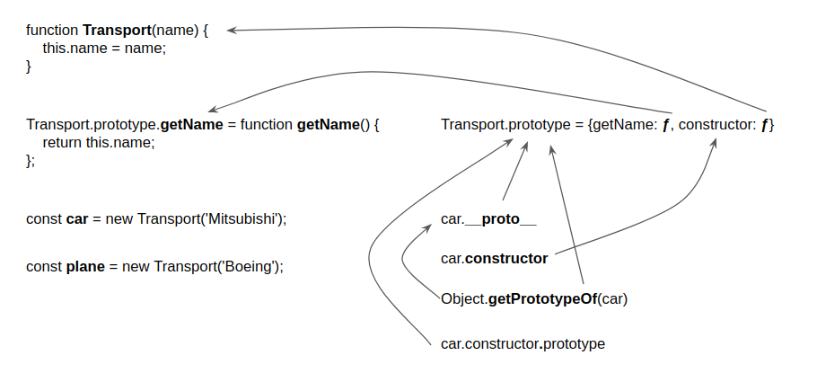
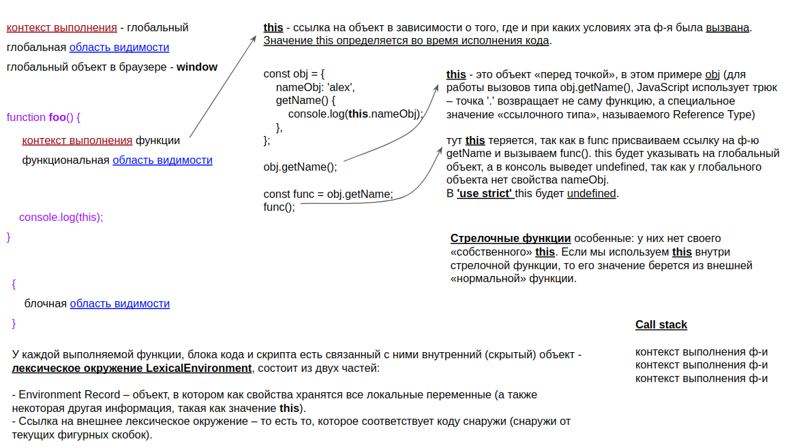

## Вопросы и [информация по JavaScript](#%d0%98%d0%bd%d1%84%d0%be%d1%80%d0%bc%d0%b0%d1%86%d0%b8%d1%8f-%d0%bf%d0%be-javascript)

#### 1. Что выведет консоль?

```javascript
console.log(true | 0)
```

- a: `true`
- b: `1`
- c: `0`
- d: `false`

<details><summary><b>Результат</b></summary>

#### Ответ: b

</details>

##
#### 2. Что выведет консоль?

```javascript
console.log(Number(null));
console.log(Number(undefined));
console.log(Number('\n'));
console.log(Number(' 12s '));
```

- a: `null` `undefined` `0` `12` 
- b: `false` `false` `false` `true`
- c: `true` `true` `true` `false`
- d: `0` `NaN` `0` `NaN`

<details><summary><b>Результат</b></summary>

#### Ответ: d

При преобразовании строки в число, движок сначала отсекает все пробельные символы, символы `\n`, и `\t` в начале и в конце строки, и возвращает `NaN` если обрезанная строка не представляет из себя корректное число. Если строка окажется пустой, то результатом будет `0`.

`null` и `undefined` обрабатываются по разному: `null` станет `0`, в то время как `undefined` станет `NaN`.

</details>

##
#### 3. Что выведет консоль?

```javascript
console.log(null == 0);
console.log(undefined == NaN);
```

- a: `true` `true`
- b: `false` `false`

<details><summary><b>Результат</b></summary>

#### Ответ: b

При применении `==` к `null` или `undefined`, численное преобразование не происходит, так как `null` может равняться только `null` или `undefined`, и ничему другому.

</details>

##
#### 4. Что выведет консоль?

```javascript
function foo() {
  console.log( this.a );
}
var a = 2;
var o = { a: 3, foo: foo };
var p = { a: 4 };

o.foo();
(p.foo = o.foo)();
```

- a: `3` `2`
- b: `3` `4`
- c: `3` `3`

<details><summary><b>Результат</b></summary>

#### Ответ: a

Результирующим значением выражения присваивания `p.foo = o.foo` является ссылка на нижележащий объект функции. Отсюда 
следует, что фактическим местом вызова будет просто `foo()`, а не `p.foo()` или `o.foo()`, как можно было ожидать. Согласно системе правил, упомянутых ранее, применяется правило связывания по умолчанию.

</details>

##
#### 5. Что выведет консоль?

```javascript
'use strict'

var myObject = {
    name: 'alex',
};

Object.preventExtensions(myObject);
myObject.age = 20;

console.log(myObject.age)
```

- a: `undefined`
- b: `20`
- c: `TypeError`
- d: `ReferenceError`

<details><summary><b>Результат</b></summary>

#### Ответ: c

`Object.preventExtensions(..)` запрещает возможность добавления новых свойств в объект, оставляя остальные свойства объекта без изменений. Если не действует режим strict, попытка создания b завершается неудачей без выдачи ошибки, обращение к свойству вернет  `undefined`. В режиме `strict` выдается ошибка `TypeError`.

Еще несколько полезных функций:

* `Object.seal(..)` - делает тоже самое, что и `Object.preventExtensions(..)`, но также все существующие свойства получают пометку `configurable:false`. Таким образом, к объекту не только нельзя добавлять новые свойства, но и также нельзя изменять конфигурацию или удалять cуществующие свойства (хотя вы можете изменять их значения).
* `Object.freeze(..)` создает «замороженный» объект; функция получает существующий объект и фактически вызывает для него `Object.seal(..)`, но также все свойства доступа к данным получают пометку `writable:false`, так что их значения не могут быть изменены.

</details>

##
#### 6. Что выведет консоль?

```javascript
var myObject = {};

console.log('name' in Object);
console.log(myObject.hasOwnProperty('name'));
```

- a: `true` `false`
- b: `false` `false`
- c: `true` `true`
- d: `false` `true`

<details><summary><b>Результат</b></summary>

#### Ответ: a

Оператор `in` проверяет, присутствует ли заданное свойство в объекте или на одном из более высоких уровней обхода цепочки `[[Prototype]]`. `hasOwnProperty(..)` только проверяет, присутствует ли свойство в объекте `myObject` или нет и не обращается к цепочке `[[Prototype]]`.

</details>

##
#### 7. Что выведет консоль?

```javascript
const a = {};
Object.defineProperty(a, 'a', {
    value: 'a',
    writable: false,
    configurable: true,
    enumerable: true,
});
const b = Object.create(a);
b.a = 'b';

console.log(b);
```

- a: `TypeError`
- b: `{ a: 'b'}`
- c: `{ a: 'a'}`
- d: `{}`

<details><summary><b>Результат</b></summary>

#### Ответ: d

Если свойство `a` находится выше в цепочке [[Prototype]] и оно помечено как доступное только для чтения `(writable: false)`, то запрещаются как назначение существующего свойства, так и создание замещенного свойства. Если код выполняется в режиме `strict` - `TypeError`, а если нет — присваивание значения свойства игнорируется. Замещение не происходит.

</details>

##
#### 8. Что выведет консоль?

```javascript
let result = [];

function responce(data) {
    const chunk = data.splice(0, 5);
    result = result.concat(chunk.map(val => val * 2));

    console.log(result);

    if (data.length > 0) {
        setTimeout(() => {
            responce(data);
        }, 0);
    }
}

const data = [1, 2, 3, 4, 5, 6, 7, 8, 9, 10];

setTimeout(() => {
    responce(data);
}, 0);

setTimeout(() => {
    console.log('First');
}, 0);

setTimeout(() => {
    console.log('Second');
}, 0);
```

- a: `Array(5)` `First` `Second` `Array(10)`
- b: `Array(5)` `Array(10)` `First` `Second`
- c: `First` `Second` `Array(5)` `Array(10)`
- d: `Array(10)` `First` `Second` `Array(10)`
  
<details><summary><b>Результат</b></summary>

#### Ответ: a

</details>

##
#### 9. Что выведет консоль?

```javascript
const p = Promise.resolve('Ok');

p.then(() => {
    console.log('A');
    p.then(() => {
        console.log('C');
    });
});

p.then(() => {
    console.log('B');
});
```

- a: `A` `C` `B`
- b: `C` `A` `B`
- c: `A` `B` `C`
- d: `Ok` `A` `C` `B`

<details><summary><b>Результат</b></summary>

#### Ответ: c

При разрешении обещания все зарегистрированные обратные вызовы then(..) будут вызваны по порядку немедленно при следующей асинхронной возможности и ничего, что происходит внутри одного из этих обратных вызовов, не сможет повлиять/отложить активизацию других обратных вызовов. Здесь `C` не может прервать и опередить `B` вследствие самого
определения механизма работы обещаний.

</details>

##
#### 10. Что выведет консоль?

```javascript
function Transport(name) {
    this.name = name;
}

Transport.prototype.getName = function getName() {
    return this.name;
};

const car = new Transport('Mitsubishi');
const plane = new Transport('Boeing');

console.log(car.__proto__ === Transport.prototype);
console.log(plane.__proto__ === car.__proto__);
console.log(Object.getPrototypeOf(car) === Transport.prototype);
console.log(plane.constructor.prototype === plane.__proto__);
```

- a: `false` `false` `false` `false`
- b: `true` `false` `true` `false`
- c: `true` `true` `true` `false`
- d: `true` `true` `true` `true`

<details><summary><b>Результат</b></summary>

#### Ответ: d

В javascript функции являются объектами. У `Transport` есть скрытое свойство `prototype`:

* `Object.getOwnPropertyDescriptor(Transport, 'prototype')` => `{value: {getName: ƒ, constructor: ƒ}, writable: true, enumerable: false, configurable: false}`

которое ссылается на объект `{ getName: ƒ, constructor: ƒ }`. Свойство `constructor` содержит ссылку на саму функцию `Transport`. У экземпляра `car` есть свойство `__proto__`, которое является свойством доступа (комбинацией геттера и сеттера) по цепочке прототипов к родителю `Transport.prototype`.



</details>

##
#### 11. Что выведет консоль?

```javascript
function Transport(name) {
    this.name = name;
}

Transport.prototype.getName = function getName() {
    return this.name;
};

const car = new Transport('Mitsubishi');
const plane = new Transport('Boeing');

console.log(plane.constructor === Transport.prototype.constructor);
console.log(plane.constructor === car.constructor);
console.log(Transport === car.constructor);
```

- a: `false` `true` `true` 
- b: `true` `false` `true` 
- c: `true` `true` `true` 
- d: `false` `false` `false`

<details><summary><b>Результат</b></summary>

#### Ответ: c

У экземпляров `car` и `plane` нет свойства `constructor`:

* `plane.hasOwnProperty('constructor')` => `false`

но есть свойство `__proto__`, которое является свойством доступа (комбинацией геттера и сеттера) по цепочке прототипов к родителю `Transport.prototype` у которого есть свойство `constructor`, которое в свою очередь указывает на функцию `Transport`.


</details>

##
#### 12. Что выведет консоль?

```javascript
async function useAsync() {
    Promise.reject('Opps!');
}

useAsync()
    .then(res => {
        console.log(res);
    })
    .catch(err => {
        console.log(err);
    });
```

- a: `'Opps!'` 
- b: `ничего`
- c: `Promise {<pending>}`
- d: `undefined`

<details><summary><b>Результат</b></summary>

#### Ответ: d

Промис будет выполнен успешно и ошибка поглотится. Только `await` бросает ошибки. Неуспешно выполнившийся промис синхронную ошибку не бросает, она поглощается. Дополнительно консоль выведет ошибку `Uncaught (in promise) Opps!`.

</details>

##
#### 13. Что выведет консоль?

```javascript
const promise = new Promise((res, rej) => {
    res('Ok1', 'Ok2');
    rej('Err1', 'Err2');
});

promise
    .then(res => {
        console.log('res', res);
    })
    .catch(err => {
        console.log('err', err);
    });
```

- a: `res Ok1` 
- b: `res Ok1 Ok2`
- c: `res Ok1 Ok2` `err Err1 Err2`
- d: `res Ok1` `err Err1`

<details><summary><b>Результат</b></summary>

#### Ответ: a

Обещания могут иметь не более одного результата разрешения (выполнение или отказ). Если по какой-то причине код создания обещания попытается многократно вызвать `resolve(..)` или `reject(..)` или попытается вызвать обе функции, обещание примет только первое разрешение и незаметно проигнорирует все последующие попытки.

Необходимо учитывать один важный момент: если вызвать `resolve(..)` или `reject(..)` с несколькими параметрами, все последующие параметры, кроме первого, будут проигнорированы. Если вы хотите передать несколько значений, необходимо заключить их в одно передаваемое значение (например, массив или объект).

</details>

##
#### 14. Что выведет консоль?

```javascript
Promise.resolve('ok')
    .then(res => {          // шаг 1
        foo.bar();
        console.log('then1');
    })
    .then(res => {          // шаг 2
        console.log('then2');
    })
    .catch(err => {         // шаг 3
        console.log('err');
    })
    .then(res => {          // шаг 4
        console.log('then3');
    });
```

- a: `then2` `err` `then3`
- b: `then2` `err`
- c: `err`
- d: `err` `then3`

<details><summary><b>Результат</b></summary>

#### Ответ: d

Когда на шаге 1 происходит ошибка, обработчик отказа на шаге 3 перехватывает его. Если после `catch` есть `then`, выполняется обещание для следующего шага 4, так что цепочка снова находится в состоянии выполнения.

</details>

##
#### 15. Что выведет консоль?

```javascript
const human = {
    name: 'nameHuman',
    getName: function getName() {
        return this.name;
    },
};

const man = Object.create(human);
man.name = 'alex';
human.surname = 'surnameHuman';

console.log(man.surname);
```

- a: `surnameHuman`
- b: `undefined`
- c: `TypeError`
- d: `null`

<details><summary><b>Результат</b></summary>

#### Ответ: a

Так как у `human` есть свойство `surname` и мы используем преимущества делегирования от `man` к `human`, то у объекта `man` есть доступ к свойству `surname` по цепочке прототипов.

</details>

## Информация по JavaScript

#### Объявление геттеров и сеттеров в объектах:

```javascript
var myObject = {
    get name() {
        return this._name;
    },
    set name(name) {
        this._name = name;
    }

};
myObject.name = 'bobi'
console.log(myObject.name)
```
##
#### this, контекст выполнения, область видимости, лексическое окружение (LexicalEnvironment):




